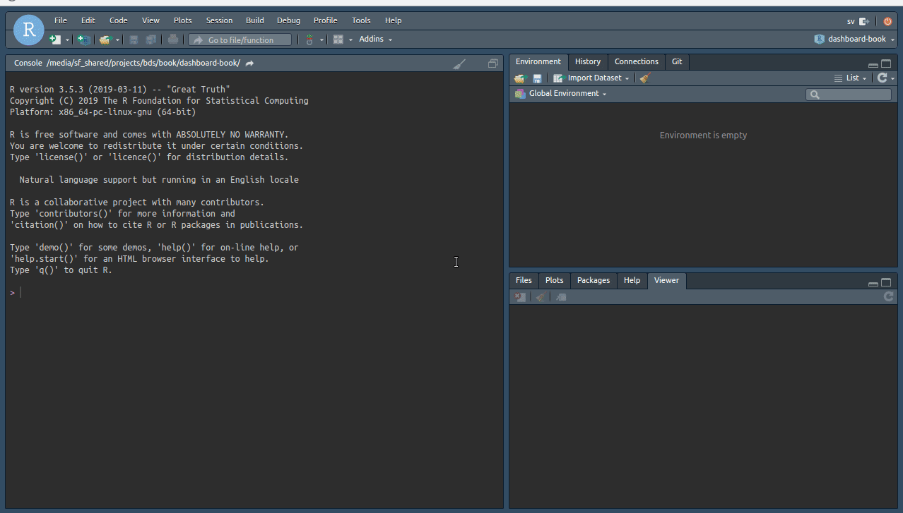
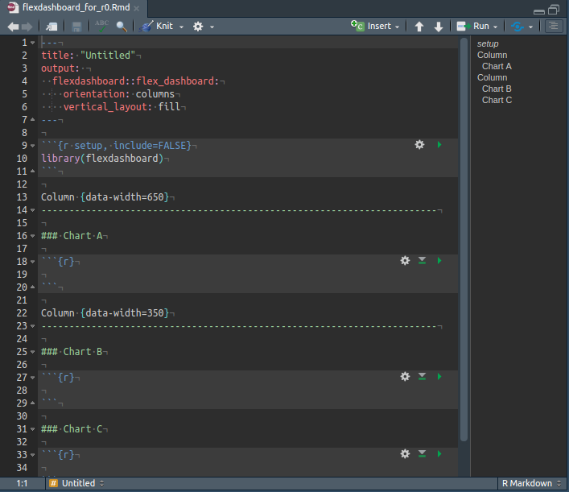
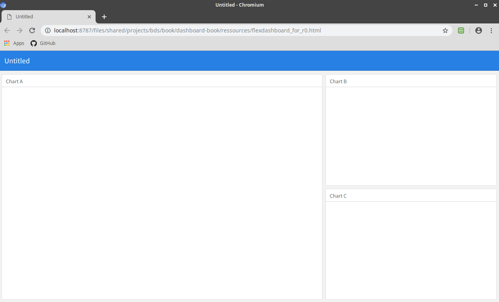

```{r setup, include=FALSE}
knitr::opts_chunk$set(echo = TRUE)
# Package
SciViews::R
```

#### Objectifs {-}

- Découvrir des formats de sorties particuliers avec le du R Markdown

#### Prérequis {-} 

Pour appréhender les notions vues dans le cadre de ce *module*, vous devez maitrisez et comprendre les notions de base du format R Markdown.

# Introduction

Depuis les tous premiers cours donnés dans le cadres des cours de science des données, nous sommes confrontés au format R Markdown. Il nous a été présenté que nous avions la possibilité de combiner des zones de code (les chunks) et des zones de texte (markdown). Les documents R Markdown peuvent être combiné en différents formats comme un document pdf, un page html ou encore un document Word. Le format R Markdwon permet de produire des formats de sortie bien plus varié que les trois proposé ci-dessous. Et si je vous disais qu'il était possible de réalsier : 

- des présentations au format pdf ou html ;
- des tableaux de bord statiques ou interactifs ;
- des sites web ;
- des pages html dynamique (comme vos tutoriels de fin de module) ;
- des livres; des posters; un C.V. ; 
- des articles scientifiques ;
- ....

Malgré que certaines conventions dans la structuration du document peuvent changer, vous retrouverez toujours les trois partie qui structure vos documents R Makdown que sont le préambule, les zones de textes et les zones de codes.

Tout cela est possible très simplement en modifiant dans le préambule l'instruction output par le format de sortie de votre choix. Nous vous proposons dans ce document les intructions de base afin de réaliser vos propres tableaux de bord. Nous Utilserons pour ce faire le package `flexdashboard`. 

# Procédure

Dans l'onglet `File`, puis `New File` et enfin `RMarkdown...` vous avez la possibilité de créer un nouveau fichier au format R Markdown. Une boite de dialogue s'ouvre et vous propose de configurer votre fichier afin que le format de sortie soit 

- `Document` : document au format html, PDF ou encore Word
- `Presentation`: présentation sous la forme de slides au format html, PDF, PowerPoint
- `Shiny` : document ou présentation dynamique en html 
- `From Template` : série de formats de sortie varié comme les articles scientifiques, les tableaux de bords, les C.V., ....

Dans l'onglet `From Template` nous sélectionnons le `Flex Dashboard` et c'est fait. Un nouveau fichier R Markdown est préconfiguré pour nous permettre de nous lancer dans ce format de sortie dès plus sympathique. 

 

Analysons le template proposé et le rendu du tableau de bord.

 

Analysons ensemble le fichier .Rmd :

- Dans le préambule, on peut observer que le format de sortie est réalisé grâce à la fonction flex_dashboard du package flexdashboard.

- Dans la zone de texte, 
    + Les colonnes de notre dashboard semble être limité par le mot `column` suivi d'un rangée de tirets.
    + La largeur des colonnes peut être modifié par l'instruction data-width=650 ou encore data-width=350 
    + On également observer que les zones sont délimitées par 3 dièses (#)

- On retrouve des chunks tout ce qu'il y a de plus courant maintenant dans un R Markdown.




Analysons le rendu en html :

- Le format de sortie est bien un tableau de bords
- Deux colonnes sont présentes de largeur différentes
- Trois zones sont présentes 

#### A vous de jouer ! {-}

```{block2, type = "bdd"}
Est ce compliqué ? Nous ne le pensons pas. Laissez libre cours à votre imagination et surprenné nous avec des tableaux de bords des plus sophistiqués.

Lisez les proposition faites via le lien suivant :

  <https://rmarkdown.rstudio.com/flexdashboard/>
```


